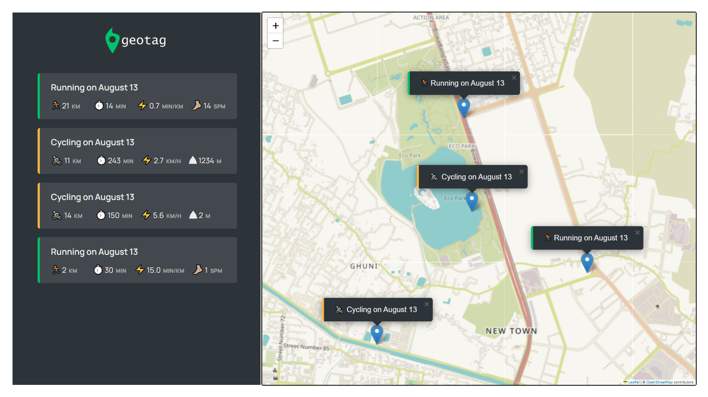

# Workout Tracker

This is a simple web application that allows users to track their running and cycling workouts on a map. The app captures workout details such as distance, duration, and additional specific metrics like cadence for running or elevation gain for cycling. All data is stored in the browser's local storage, so your workouts are saved even when you close the app.

## Features

- **Location-Based Tracking:** Automatically captures your geographic location to set the workout's starting point on the map.
- **Workout Types:** Supports both running and cycling workouts with specific metrics:
  - **Running:** Captures distance, duration, and cadence.
  - **Cycling:** Captures distance, duration, and elevation gain.
- **Interactive Map:** Uses Leaflet to display the map and allow users to add workouts by clicking on the map.
- **Workout List:** Displays a list of all workouts with key metrics, and users can click on a workout to zoom in on its location on the map.
- **Local Storage:** Saves all workouts in the browser's local storage, ensuring data persistence between sessions.
- **Responsive UI:** Dynamic forms that adjust based on the workout type selected (e.g., toggling between cadence and elevation inputs).

## How to Use

1. **Load the App:** When the app loads, it will ask for your permission to access your location. This is required to set the starting point of your workouts on the map.
2. **Add a Workout:**
   - Click on the map to bring up the workout form.
   - Select the type of workout (running or cycling).
   - Enter the distance, duration, and either cadence (for running) or elevation gain (for cycling).
   - Submit the form to add the workout.
3. **View Workouts:** Added workouts will be marked on the map and listed below the form. Click on a workout in the list to zoom in on its location on the map.
4. **Reset Workouts:** To clear all workouts, open the browser console and call the `reset()` method on the `app` object. This will remove all workouts from local storage and reload the page.

## Technologies Used

- **JavaScript (ES6+):** Core application logic, class-based architecture.
- **Leaflet:** Interactive maps for workout location tracking.
- **HTML/CSS:** Structure and style of the application.
- **LocalStorage:** Persistent data storage in the browser.

## Project Structure

- **`index.html`:** The main HTML file containing the structure of the app.
- **`style.css`:** The CSS file for styling the app.
- **`script.js`:** The main JavaScript file containing the app's logic and interactivity.

## Installation

1. Clone the repository:
   ```bash
   git clone https://github.com/reetpriye/geotag-js.git
   ```
